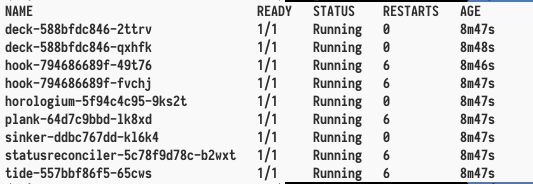

# Prow使用指南


## 简介

**Prow**是k8s使用的CI/CD系统(<https://github.com/kubernetes/test-infra/tree/master/prow>)，用于管理k8s的issue和pr。如果你经常去k8s社区查看pr或者提交过一些Pr后，就会经常看到一个叫**k8s-ci-bot**的机器人在各个Pr中回复，并且还能合并pr。在k8s-ci-bot中背后工作的就是Prow。Prow是为了弥补github上一些功能上的缺陷，它也是Jenkins-X的一部分，它具备这些功能：

1. 执行各种Job，包括测试，批处理和制品发布等，能够基于github webhook配置job执行的时间和内容。
2. 一个可插拔的机器人功能（**Tide**），能够接受`/foo`这种样式的指令。
3. 自动合并Pr
4. 自带一个网页，能够查看当前任务的执行情况以及Pr的状况，也包括一些帮助信息
5. 基于OWNER文件在同一个repo里配置模块的负责人
6. 能够同时处理很多repo的很多pr
7. 能够导出Prometheus指标

Prow拥有自己的CI/CD系统，但是也能与我们常见的CI/CD一起协作，所以如果你已经习惯了Jenkins或者travis，都可以使用Prow。
## 安装指南

> 官方repo提供了一个基于GKE快速安装指南，本文将基于青云的[QKE](https://github.com/QingCloudAppcenter/QKE])(QingCloud Kubernetes Engine)搭建Prow环境。不用担心，其中大部分步骤都是平台无关的，整个安装过程能够很方便的在其他平台上使用。

### 一、 准备一个kubernetes集群

在青云控制台上点击左侧的容器平台，选择其中的QKE，简单设置一些参数之后，就可以很快创建一个kubernetes集群。

### 二、 准备一个github机器人账号
> 如果没有机器人账号，用个人账号也可以。机器人账号便于区分哪些Prow的行为，所以正式使用时应该用机器人账号。

1. 在想要用prow管理的仓库中将机器人账号设置为管理员。
2. 在账号设置中添加一个[personal access token][1]，此token需要有以下权限：
   
   + **必须**：`public_repo` 和 `repo:status`
   + **可选**：`repo`假如需要用于一些私有repo
   + **可选**：`admin_org:hook` 如果想要用于一个组织
3. 将此Token保存在文件中，比如`${HOME}/secrets/oauth`
4. 用`openssl rand -hex 20`生成一个随机字符串用于验证webhook。将此字符串保存在本地，比如`${HOME}/secrets/h-mac`

*注意最后两步创建的token一定需要保存好，除了需要上传到k8s，后续配置也要用到，用于双向验证*

### 三、 配置k8s集群
> 这里使用的default命名空间配置prow，如果需要配置在其他命名空间，需要在相关`kubectl`的命令中配置`-n`参数，并且在部署的yaml中配置命名空间。
> 
1. 将上一步中创建token和hmac保存在k8s集群中
```bash
# openssl rand -hex 20 > ${HOME}/secrets/h-mac
kubectl create secret generic hmac-token --from-file=hmac=${HOME}/secrets/h-mac
kubectl create secret generic oauth-token --from-file=oauth=${HOME}/secrets/oauth
```
2. 部署Prow。由于Prow官方yaml中使用了grc.io镜像，这个镜像在中国大陆无法访问，所以我们将相应的repo搬到了dockerhub上，并提供了一份替换相关镜像名称的[yaml](prow.yaml)，利用下面的命令即可部署Prow
```bash
kubectl apply -f https://raw.githubusercontent.com/magicsong/prow-tutorial/master/prow.yaml
```
3. 使用`kubectl get pod`看到所有Pod都running表示安装已经完成。如下图：



4. 配置外网访问
**恭喜你！你已经拥有了一个prow集群，这个集群已经准备工作了，下一步就是要做一些配置工作，以使得Prow能按照我们的意图工作。**

## 配置指南
> Prow配置较为复杂，这里只演示一些简单的基本的配置。

1. 安装[bazel](https://docs.bazel.build/versions/master/install.html)。Bazel是google公司用来构建k8s代码的一个工具，同样prow也是用bazel构建的。后续的配置都是用bazel动态生成的工具来配置的（类似于`go run  ./pkg/tool -a -b`）。如果你身处非大陆地区，也可以不用Bazel，直接时候用`go get`来获取静态binay执行命令。
2. 安装完成之后需要将整个仓库<https://github.com/kubernetes/test-infra> 整个仓库clone下来，用于Bazel运行命令的仓库。
3. 
[1]: https://github.com/settings/tokens